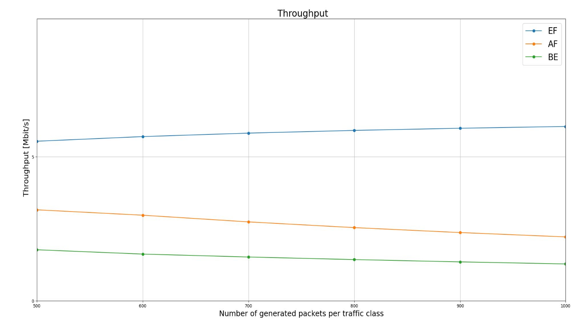
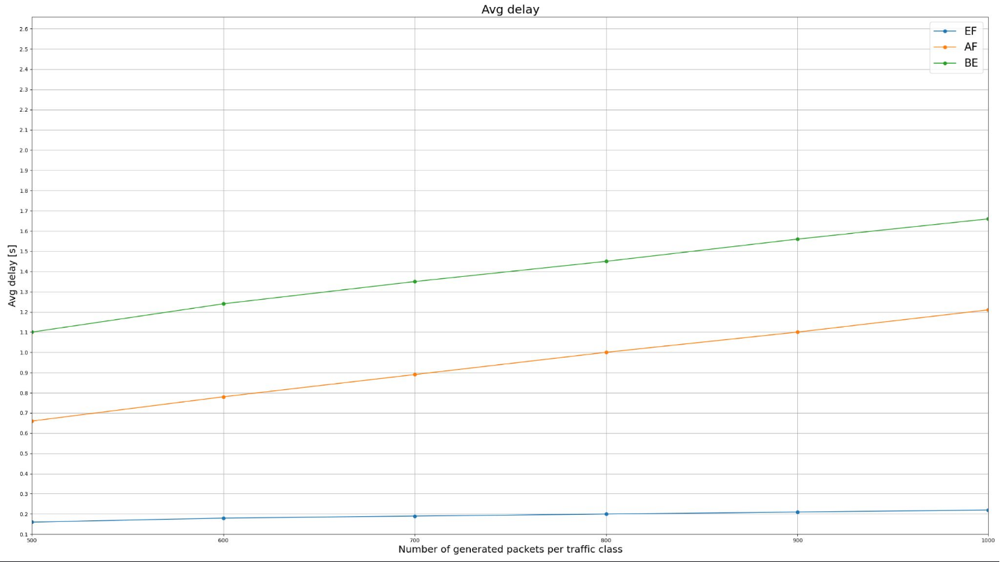
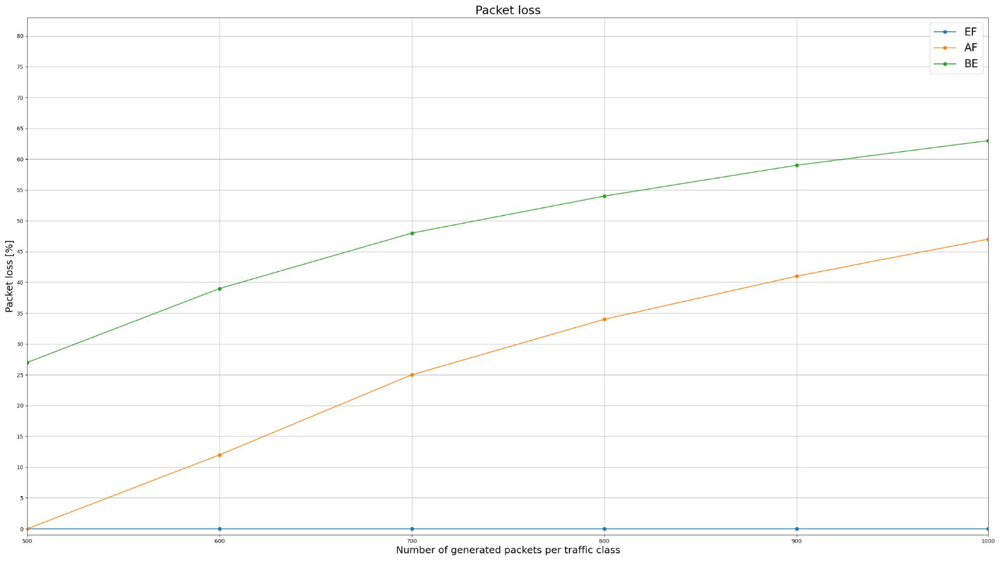

# 📶 DiffServ QoS Evaluation in ns-3

## Overview

This directory contains a simple **PFIFO + DiffServ** (Differentiated Services) network scenario to evaluate the QoS performance of three traffic classes:

- **EF (Expedited Forwarding)** – VoIP traffic
- **AF41 (Assured Forwarding)** – video streaming traffic
- **BE (Best Effort)** – FTP/file transfer traffic

The goal is to analyze how PFIFO queue sizes affect performance metrics like delay, jitter, throughput, and packet loss under different priority classes.

## Network topology

```text
[Client EF]   [Client AF]   [Client BE]
     |             |             |
     +-------------+-------------+
                   |
            [Edge Router]
                   |
           (bottleneck link)
                   |
            [Core Router]
              /    |    \
   [Server EF] [Server AF] [Server BE]
```

## Usage

Run the simulation with custom queue sizes (optional):

```bash
./ns3 run "network_topology --ef=100 --af=400 --be=500"
```

Alternatively run with default queue length values:

```bash
./ns3 run network_topology
```

## Results

This section shows how DiffServ traffic classes behave as network load increases. The x-axis indicates the number of packets generated for each traffic class.

### Throughput



### Average delay



### Packet loss




